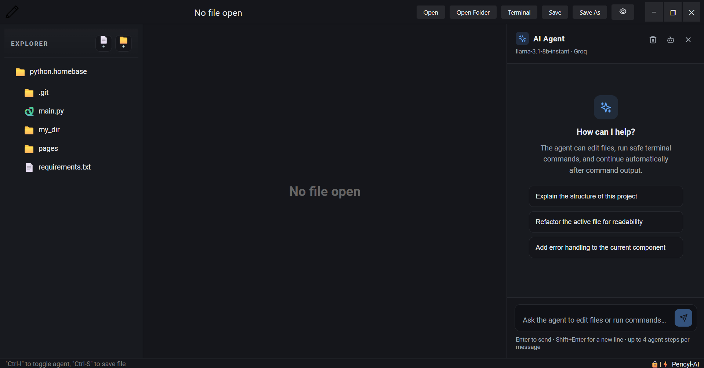
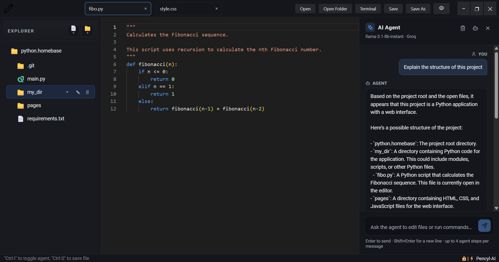
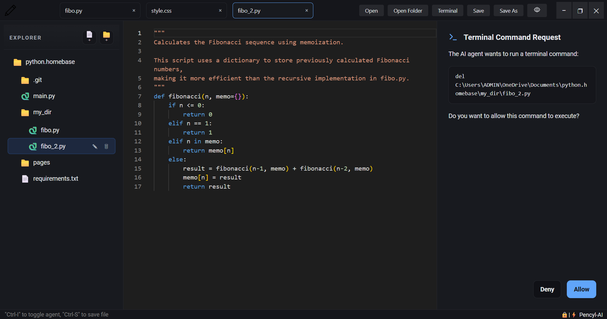
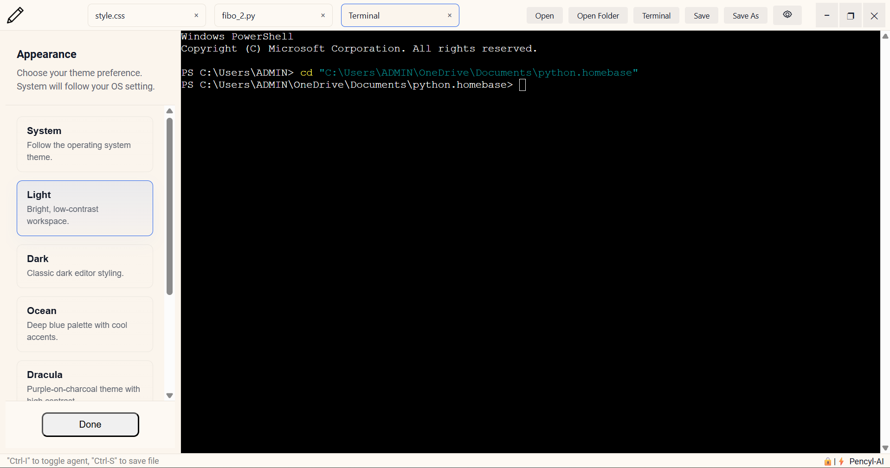

<p align="center">
  
</p>

<h1 align="center">Pencyl AI</h1>

<p align="center">
  <strong>A lightweight, lightning-fast desktop IDE with seamless AI integration and precision code control.</strong>
</p>

<p align="center">
  <a href="#-why-pencyl-ai">Why Pencyl AI?</a> •
  <a href="#-key-features">Features</a> •
  <a href="#-screenshots">Screenshots</a> •
  <a href="#-tech-stack">Tech Stack</a> •
  <a href="#-quick-start">Quick Start</a> •
  <a href="#-license">License</a>
</p>

<p align="center">
  
  
  
  
  
  
</p>

---

<p align="center">
  
</p>

---

## 💡 Why Pencyl AI?

Traditional AI-powered code editors can feel sluggish, heavy, and resource-hungry—often consuming gigabytes of RAM and bogging down your system just to stay open.

**Pencyl AI** is designed from the ground up to be an **ultra-lightweight, lightning-fast IDE with seamless AI integration**. Powered by **Tauri 2.0 (Rust)** and the **Monaco Editor**, Pencyl delivers sub-second startup times and a minimal memory footprint while giving you deep, controllable AI collaboration—offering the raw performance of a native desktop app with the intelligence of modern LLMs.

---

## ✨ Key Features

### 🛡️ 1. Native Monaco Diff Engine
* **Side-by-Side Review:** Never let an LLM overwrite your files blindly. File updates generated by the AI agent are streamed into a dedicated Monaco Diff Viewer.
* **Granular Control:** Inspect line-by-line syntax highlighting, compare proposed changes against your working copy, and click **Accept** or **Reject** before anything touches your disk.

### 🤖 2. Sandboxed Terminal Guardrails
* **In-Editor CLI Actions:** The AI agent can request build, test, and setup commands directly within the workspace.
* **Safety Confirmation Modal:** Every command triggers an interactive **Allow / Deny** prompt so you always retain full control over system calls.
* **Command Blacklist:** Automatically blocks non-interactive shell freezes and validates paths against your active workspace root.

### 🎨 3. Customizable UI & Theme Engine
* **Multiple Theme Presets:** Includes built-in support for **Dark**, **Light**, **Dracula**, **Sage**, and **Caffeine** color palettes.
* **System Theme Sync:** Respects your operating system's dark/light preferences out of the box.

### 🔑 4. Multi-Provider & Local Offline Support
* **Cloud LLMs:** Fast inference using Groq, OpenAI, and Anthropic API keys.
* **100% Offline via Local Models:** Connect seamlessly to Ollama or LM Studio to run models (Llama 3, DeepSeek-Coder, Qwen) fully offline with complete privacy.

---

## 📸 Screenshots

<div align="center">

### Side-by-Side Diff Inspection


<br/><br/>

### Sandboxed Terminal Command Confirmation


<br/><br/>

### Built-in Theme Customization


</div>

---

## 🏗️ Tech Stack

Pencyl AI separates UI rendering from OS-level file I/O and process execution using an asynchronous Rust Inter-Process Communication (IPC) bridge:

<div align="centre">
  ┌─────────────────────────────────────────────────────────────────┐ 
  │                      Pencyl AI Desktop App                      │ 
  ├────────────────────────────────┬────────────────────────────────┤ 
  │      React 18 Frontend UI      │      Tauri 2.0 Rust Core       │ 
  │                                │                                │ 
  │   ┌────────────────────────┐   │   ┌────────────────────────┐   │ 
  │   │     Monaco Editor      │   │   │     IPC Event Bus      │   │ 
  │   └───────────┬────────────┘   │   └───────────▲────────────┘   │ 
  │               │                │               │                │ 
  │   ┌───────────▼────────────┐   │   ┌───────────┴────────────┐   │ 
  │   │   Zustand State (Diff) │───┼──►│  Terminal Execution    │   │ 
  │   └───────────┬────────────┘   │   └───────────┬────────────┘   │ 
  │               │                │               │                │ 
  │   ┌───────────▼────────────┐   │   ┌───────────▼────────────┐   │ 
  │   │   AI Agent Engine      │   │   │   Local File System    │   │ 
  │   └────────────────────────┘   │   └────────────────────────┘   │ 
  └────────────────────────────────┴────────────────────────────────┘ 
</div>
* **Frontend:** React 18, TypeScript, Zustand (State Management), Monaco Editor (`@monaco-editor/react`), Lucide React.
* **Backend:** Tauri 2.0, Rust (Command Invocation, File I/O, Subprocess Execution).
* **Styling:** CSS Variables with dynamic theme attribute binding.

---

## 🚀 Quick Start

### Prerequisites

Ensure you have the following installed on your machine:

* **Node.js:** `v18.0.0` or higher
* **npm:** `v9.0.0` or higher
* **Rust Toolchain:** `stable` ([Install Rust](https://www.rust-lang.org/tools/install))
* **OS Prerequisites:** [Tauri v2 Prerequisites](https://v2.tauri.app/start/prerequisites/) for your operating system.

### Installation

1. **Clone the Repository:**
   ```bash
   git clone [https://github.com/GreatChijioke-01/pencyl-ai.git](https://github.com/GreatChijioke-01/pencyl-ai.git)

   cd pencyl-ai
   npm install
   npm run tauri dev

**📦 Building for Production**
  To compile a standalone, optimized desktop binary (.exe, .msi, .dmg, or .AppImage):

  npm run tauri build

## 📄 License

Distributed under the **Apache License 2.0**. See [`LICENSE`](./LICENSE) for more details.